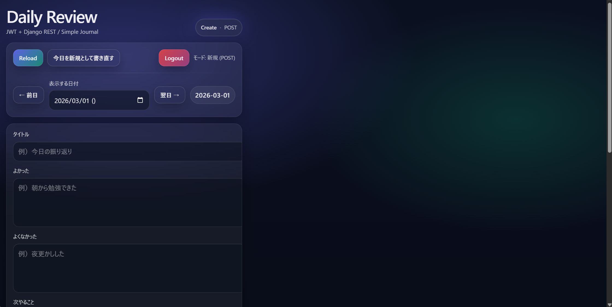

# Daily Review (JWT)

📌  **Live Demo**
- Frontend (Vercel): https://daily-review-dun.app
- Backend (Render): https://daily-review-api.onrender.com

1日1件の振り返りを記録するシンプルなジャーナルアプリです。
JWT認証を利用し、日付ごとに記録を作成・更新できます。

※ Render無料プランのため、初回アクセス時にAPI起動まで30秒ほどかかる場合があります。

## Screenshot


## Features
- JWTログイン（access / refresh トークン）
- 日付ごとの記録管理
- 前日 / 翌日切り替え
- 1日1件の記録制限
- mood（1〜5）入力
- 自分のデータのみ閲覧可能

## Architecture
- Vercel (React / Vite)
- Render (Django REST + JWT)
- Render PostgreSQL

## Tech Stack
### Frontend
- React
- Vite
### Backend
- Django
- Django REST Framework
- SimpleJWT
### Database
- PostgreSQL (Render)
### Deployment
- Vercel(Frontend)
- Render(Backend + DB)
### Other
- django-cors-headers
- whitenoise
- gunicorn

## API (主要エンドポイント)
- POST /api/token/
ログイン（access / refresh トークン発行）

- POST /api/token/refresh/
access token 再発行

- GET /api/entries/
日記一覧取得

- POST /api/entries/
日記作成

- PATCH /api/entries/{id}/
日記更新

- DELETE /api/entries/{id}/
日記削除

## Design Decisions（設計の工夫）
### 1) 1日1件の制約
DBレベルで (user, date) の UniqueConstraint を設定し
同日に複数の記録が作られないようにしています。
```
UniqueConstraint(fields=["user", "date"])
```


### 2) 認可（自分のデータのみ取得）
ViewSetの `get_queryset()` を `request.user` でフィルタすることで他ユーザーのデータが取得できないようにしています。

### 3) JWTトークンの自動更新
401エラー発生時に refresh token を使ってaccess token を再発行し、APIを1回だけ再試行する実装をしています。

### 4) 本番環境対応
Render環境では
- `DATABASE_URL` からDB設定
- `whitenoise`による静的配信
- `gunicorn`をWSGIサーバとして使用
- `CORS_ALLOWED_ORIGINS`を環境変数管理

## Tests
Backendテスト
```bash
cd backend
python manage.py test
```

## Local Setup
### Backend
```
cd backend

python -m venv .venv
source .venv/bin/activate

pip install -r requirements.txt

python manage.py migrate
python manage.py runserver
```
### Frontend
```
cd frontend

npm install

cp .env.example .env

npm run dev
```

## Future Improvements
- カレンダーUI
- 月表示
- HttpOnly Cookie認証
- GitHub Actions CI
- E2Eテスト